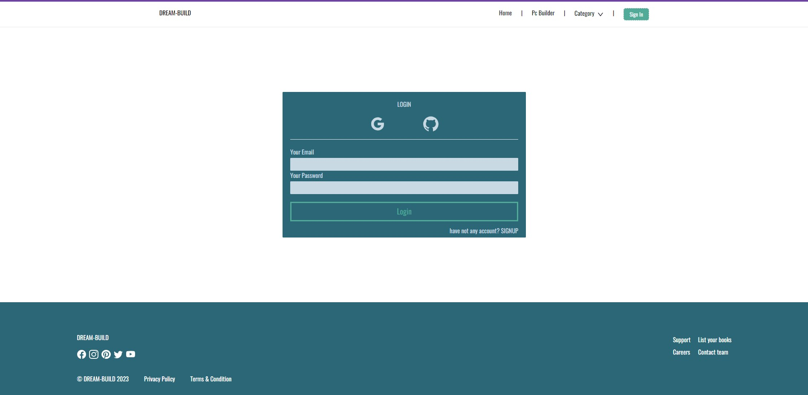
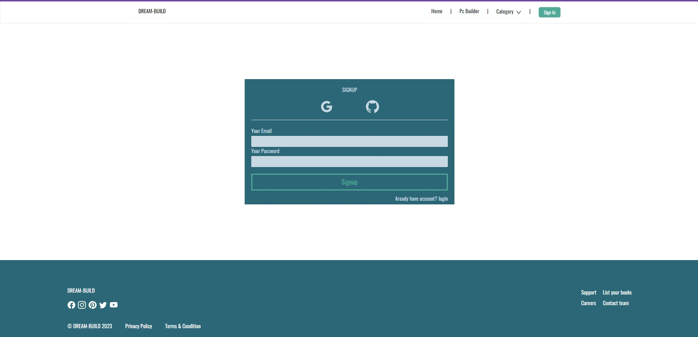
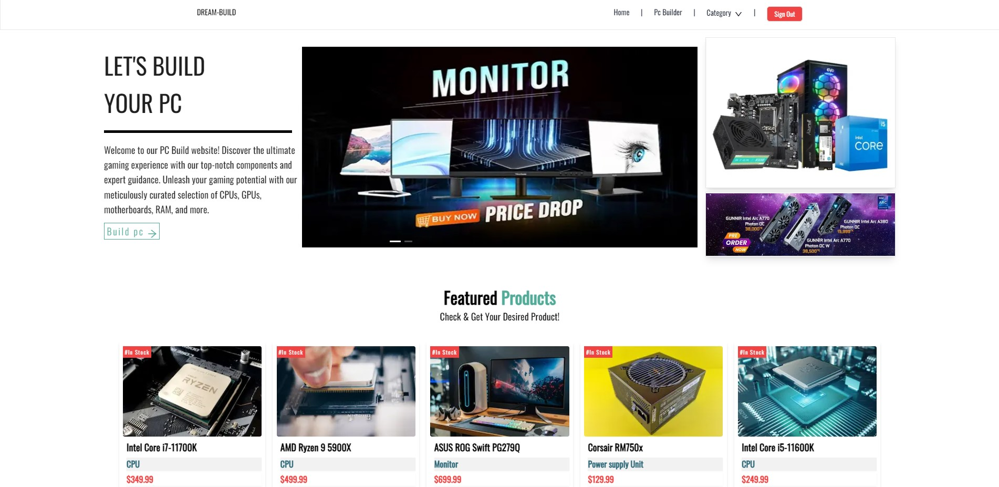
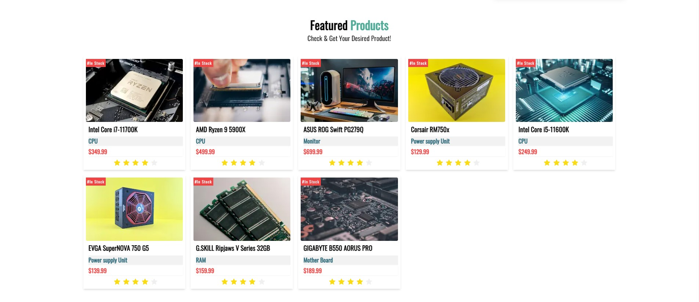
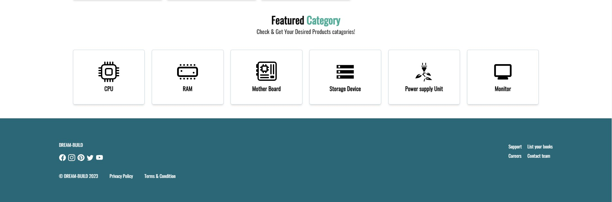
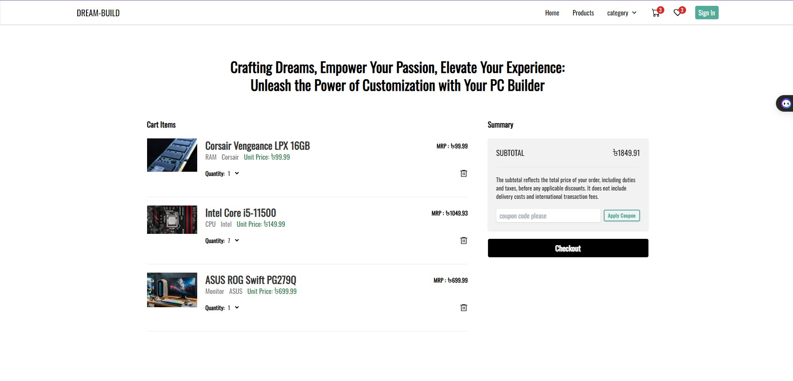
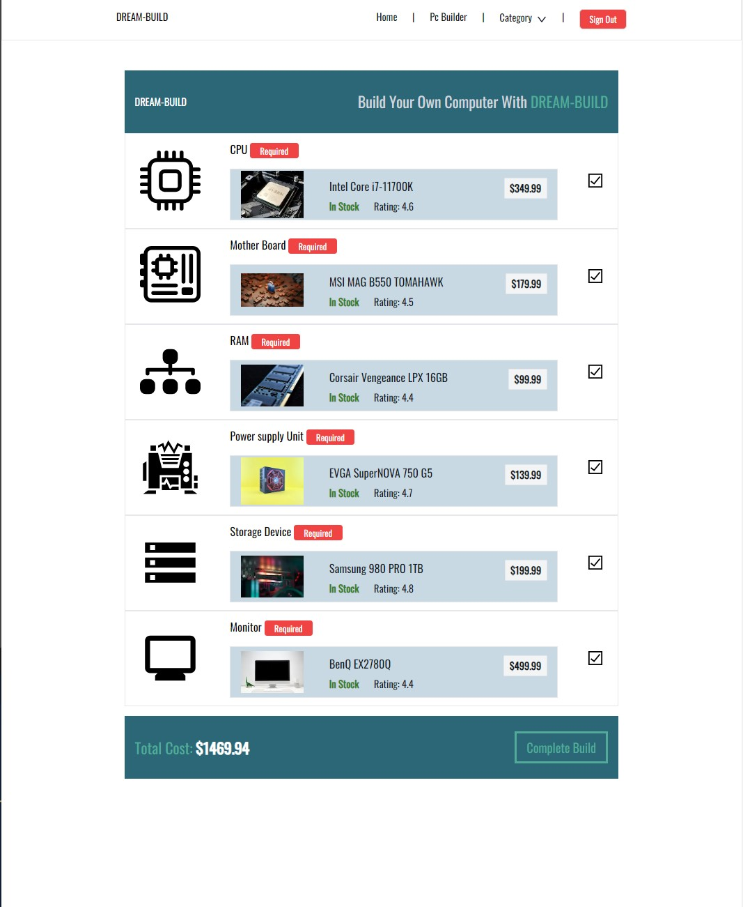
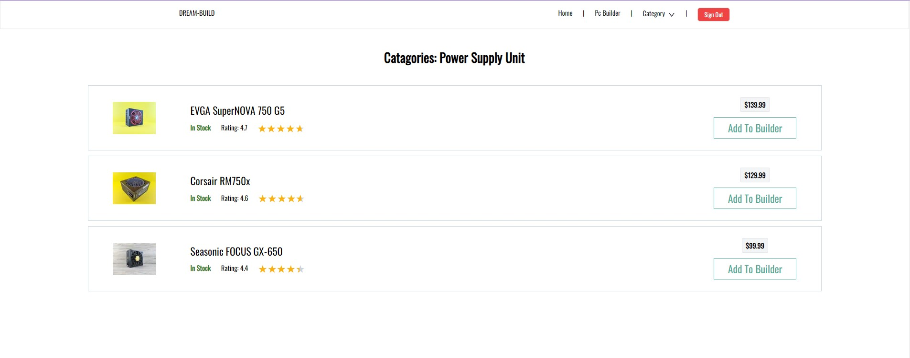

# [Dream Build](https://dream-build.vercel.app/)

_A simple e-commerce, pc-building, pc-component details system powered by next.js_

### Description

- PC Builder website for PC parts and components using Next.js with desktop and mobile responsive.
- select component and build your own pc.
- SSG implementation,SSR implementation, client side rendering with redux-toolkit.
- Next-Auth and firebase for authentication

### Languages/Technologies (Frontend)

- JavaScript
- Next.js
- next-auth
- ant design framework
- tailwind
- reduxjs
- reduxjs-toolkit
- Firebase
- react-firebase-hooks
- react-hook-form
- react-google-login

### Run

Then, to spawn clients, go to the directory and execute the following commands:

```
$ yarn
$ yarn dev
```

### Screenshots

Some screenshots of the project from different types of users are available in the [screenshots](./screenshots/) directory.

#### The login screen:



#### The signup screen:



#### home page:





#### cart page:



#### Pc-Building page (only login user):



#### List list of select product for build pc (only login user):



### user account

If the database is up and running (take 2/3 min), use the following credentials to login as a user:

```
username: mdkzaman2025@gmail.com
password: 123456
```

### Authors

This project was authored by [Md Kamruzzaman](https://github.com/YeBenLing-ZAMAN/).
